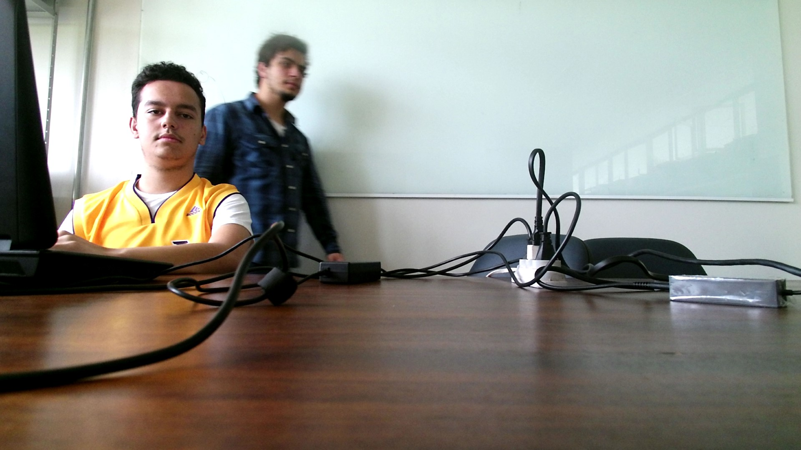
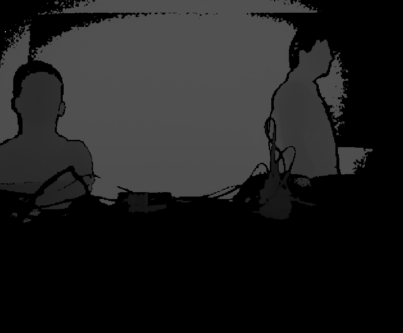
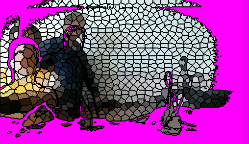
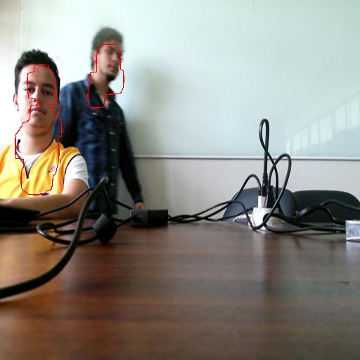

# FaceSegVideoSuperVoxelsKinect
### Trabalho Final de Principios de Visão Computacional 2/2017
O trabalho consiste na detecção de faces em vídeos obtidos a partir do Kinect V2, segmentados em supervoxels.

  
   
  <t><b>Figura 1</b>: Frame de cor obtido a partir do Kinect V2.</t>
   

  
   
  <t><b>Figura 2</b>: Frame de profundidade obtido a partir do Kinect V2.</t>
   

  
   
  <t><b>Figura 2</b>: Segmentação DASP a partir dos frames de cor e profundidade.</t>
   

  
   
  <t><b>Figura 4</b>: Resultado Final.</t>
   

